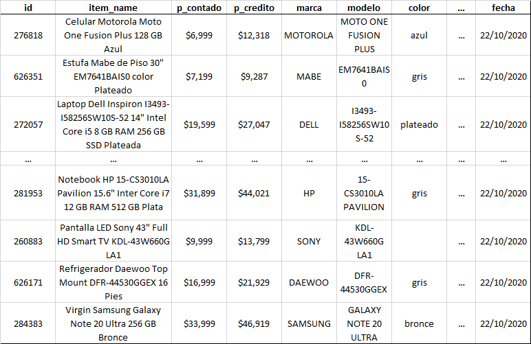

# Web Scrappping de Tienda Departamental

Se elaboró un proyecto donde se hace un Web Scrapping de varias tiendas departamentales para comparar precios para los mismos productos durante "el buen fin". En específico, el código que se muestra aquí se empleó para hacer el raspado web de los productos que [Coppel](https://www.coppel.com/) oferta en su página web.

La siguiente tabla es una muestra de los datos que se obtienen:

